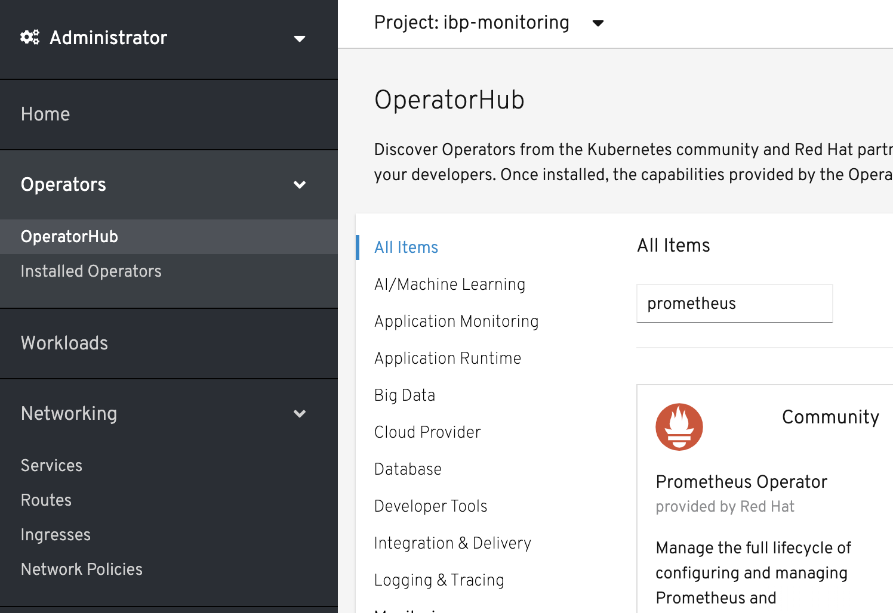
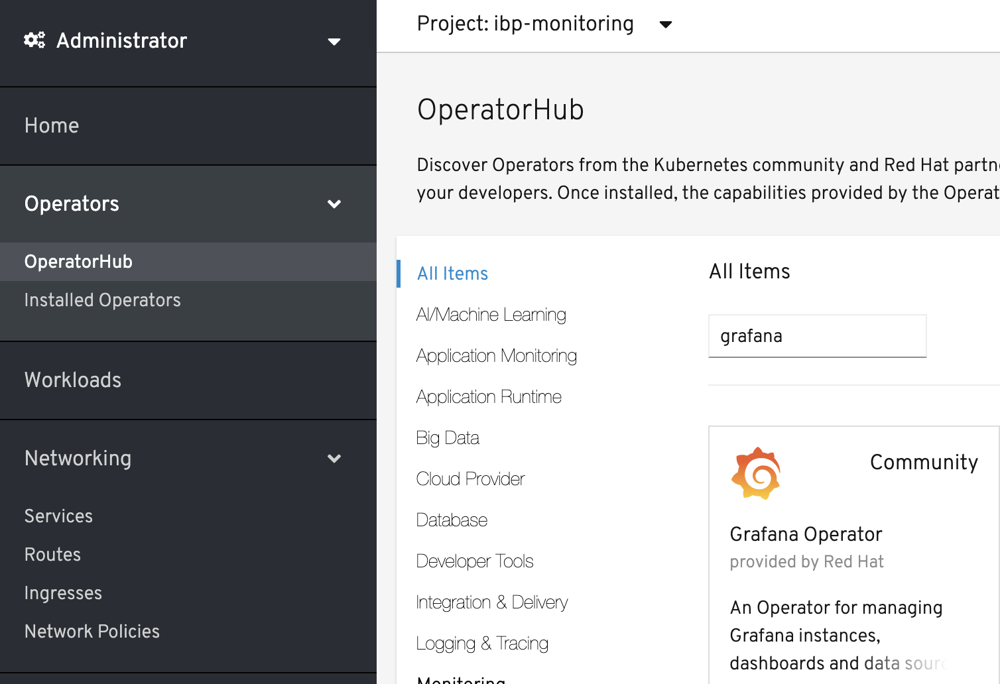
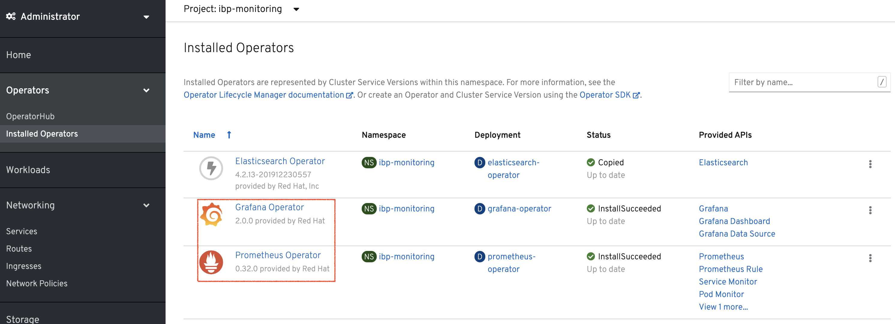
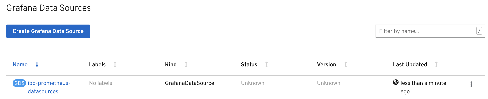
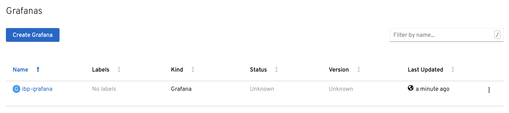
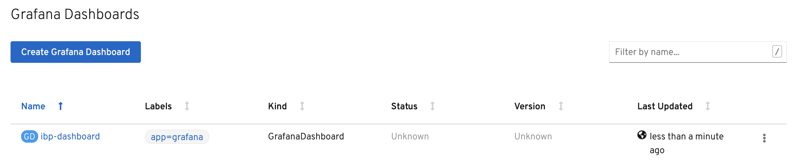

# IBM Blockchain Platform Monitoring in Openshift

## Architecture


If OLM is installed, a Prometheus operator can be deployed to a separate project. A `Prometheus` instance is required to monitor IBM Blockchain Platform. A `Grafana` deployment pulls metrics from the `Prometheus` instance

## Environment

* Openshift 4.2.12 cluster deployed on IBM Cloud Infrastructure
* IBM Blockchain Platform v2.1.2

## Prerequsities

Retrieving metrics from the peer and orderer requires mutual TLS authentication, so we need to generate certificate-key pairs for both the orderer organization and peer organization

1. In **IBP console**, go to **Nodes** > **org1ca** (the CA of the peer organization). Register a new user with enroll ID `monitoring` and enroll secret `monitoringpw`. Enroll this user against the **TLS Certificate Authority** and download the wallet. The file name of the wallet is assumed to be `org1mspmonitoring.json`

2. In **IBP console**, go to **Nodes** > **osca** (the CA of the orderer organization). Register a new user with enroll ID `monitoring` and enroll secret `monitoringpw`. Enroll this user against the **TLS Certificate Authority** and download the wallet. The file name of the wallet is assumed to be `osmspmonitoring.json`

3. Decode the certificates and private keys:

   ```console
   jq -r .private_key org1mspmonitoring.json | base64 --decode > org1mspmonitoring.key
   jq -r .cert org1mspmonitoring.json | base64 --decode > org1mspmonitoring.pem
   jq -r .private_key osmspmonitoring.json | base64 --decode > osmspmonitoring.key
   jq -r .cert osmspmonitoring.json | base64 --decode > osmspmonitoring.pem
   ```

## Prometheus Deployment

1. (Optional) Create project `ibp-monitoring`

   Note: This task can skip if this project `ibp-monitoring` exists in cluster

   ```console
   oc new-project ibp-monitoring
   ```

2. (Optional) Deploy a Prometheus and Grafana operator using OLM

   Note: This task can skip if this `prometheus-operator` and `grafana-operator` exists in project

   On `OperatorHub` tab, search for `Prometheus` and Create in project `ibp-monitoring`
   

   On `OperatorHub` tab, search for `Grafana` and Create in project `ibp-monitoring`
   

   On `Installed Operators` tab, `Grafana Operator` and `Prometheus Operator` show in the table on the screen

   

3. Create secret

   Secret name should be `<project-name>-<msp>-monitoring-secret`

   ```console
   $ oc create secret generic ibp-org1msp-monitoring-secret --from-file=./org1mspmonitoring.pem --from-file=./org1mspmonitoring.key -n ibp-monitoring
   secret/ibp-org1msp-monitoring-secret created
   $ oc create secret generic ibp-osmsp-monitoring-secret --from-file=./osmspmonitoring.pem --from-file=./osmspmonitoring.key -n ibp-monitoring
   secret/ibp-osmsp-monitoring-secret created
   ```

4. (Optional) Create `ClusterRole:

   Note: This task can skip if this ClusterRole `prometheus-ibp` exists in cluster

   ```bash
   oc apply -f clusterrole.yaml
   ```

5. Create secret for basic authentication of `Prometheus`. Remember the password set (use password: monitoring)

   Replace `<project-name> to your project

   ```bash
   htpasswd -s -c auth ibp
   oc create secret generic prometheus-<project-name>-htpasswd -n ibp-monitoring --from-file auth
   ```

6. Replace project name to config file and access to project folder

   ```bash
   bash generate-prometheus.sh <project-name>
   ```

   Example:
   ```bash
   bash generate-prometheus.sh ibp
   ```

7. Create organisation `ServiceMonitor` config file

   Verify orgname by get `MSP` and `Port` from following command

   Peer

   ```bash
   oc get svc --show-labels -l orgname -n <project-name>
   ```

   Example:
   ```bash
   oc get svc --show-labels -l orgname -n ibp
   NAME        TYPE       CLUSTER-IP       EXTERNAL-IP   PORT(S)                                                       AGE       LABELS
   peer1org1   NodePort   10.107.187.170   <none>        7051:32230/TCP,9443:32484/TCP,8080:31825/TCP,7443:31925/TCP   41m       app.kubernetes.io/instance=ibppeer,app.kubernetes.io/managed-by=ibp-operator,app.kubernetes.io/name=ibp,app=peer1org1,creator=ibp,orgname=org1msp
   ```

   You will find `orgname=org1msp` and port `9443`. Replace value in the command to generate Service Monitor config file.

   Ordering Service

   ```bash
   oc get svc --show-labels -l orderingservice -n <project-name>
   ```

   Example:
   ```bash
   oc get svc --show-labels -l orderingservice -n ibp
   NAME                   TYPE       CLUSTER-IP       EXTERNAL-IP   PORT(S)                                                       AGE       LABELS
   orderingservicenode1   NodePort   10.110.172.238   <none>        7050:31582/TCP,8443:30667/TCP,8080:31028/TCP,7443:31379/TCP   33m       app.kubernetes.io/instance=ibporderer,app.kubernetes.io/managed-by=ibp-operator,app.kubernetes.io/name=ibp,app=orderingservicenode1,creator=ibp,orderingnode=node1,orderingservice=orderingservice,parent=orderingservice
   orderingservicenode2   NodePort   10.100.100.77    <none>        7050:30717/TCP,8443:32029/TCP,8080:30141/TCP,7443:31574/TCP   33m       app.kubernetes.io/instance=ibporderer,app.kubernetes.io/managed-by=ibp-operator,app.kubernetes.io/name=ibp,app=orderingservicenode2,creator=ibp,orderingnode=node2,orderingservice=orderingservice,parent=orderingservice
   orderingservicenode3   NodePort   10.107.3.16      <none>        7050:30413/TCP,8443:32695/TCP,8080:32502/TCP,7443:30493/TCP   33m       app.kubernetes.io/instance=ibporderer,app.kubernetes.io/managed-by=ibp-operator,app.kubernetes.io/name=ibp,app=orderingservicenode3,creator=ibp,orderingnode=node3,orderingservice=orderingservice,parent=orderingservice
   orderingservicenode4   NodePort   10.109.86.219    <none>        7050:30508/TCP,8443:32329/TCP,8080:31293/TCP,7443:30528/TCP   33m       app.kubernetes.io/instance=ibporderer,app.kubernetes.io/managed-by=ibp-operator,app.kubernetes.io/name=ibp,app=orderingservicenode4,creator=ibp,orderingnode=node4,orderingservice=orderingservice,parent=orderingservice
   orderingservicenode5   NodePort   10.104.93.76     <none>        7050:30500/TCP,8443:32089/TCP,8080:32510/TCP,7443:30928/TCP   32m       app.kubernetes.io/instance=ibporderer,app.kubernetes.io/managed-by=ibp-operator,app.kubernetes.io/name=ibp,app=orderingservicenode5,creator=ibp,orderingnode=node5,orderingservice=orderingservice,parent=orderingservice
   ```
 
   You will find `orderingservice=orderingservice` and port `8443`. Replace value in the command to generate Service Monitor config file.

   ```bash
   bash generate-service-monitor.sh <project-name> <msp> <port> <matchLabels>
   ```

   Example:
   ```bash
   bash generate-service-monitor.sh ibp osmsp 8443 'orderingservice: orderingservice'
   bash generate-service-monitor.sh ibp org1msp 9443 'orgname: org1msp'
   ```

8. Update `Prometheus` config

   Open prometheus config file

   ```bash
   cd proj-<project-name>
   vi prometheus.yaml
   ```

   in `secret` session replace `- <project-name>-<msp>-monitoring-secret` secret (under htpasswd) from step 3
   
   Example:
   ```
   - ibp-osmsp-monitoring-secret
   - ibp-org1msp-monitoring-secret
   ```

9. Create required `Secrets`:

   ```bash
   oc apply -f secrets.yaml
   ```

10. Create `ServiceAccount` and `ClusterRoleBinding`:

   ```bash
   oc apply -f serviceaccount.yaml
   oc apply -f clusterrolebinding.yaml
   ```

11. Create `Service` and `Route`. TLS secret for prometheus proxy will be created automatically (Refer to <https://docs.openshift.com/container-platform/3.11/dev_guide/secrets.html#service-serving-certificate-secrets)>

    ```bash
    oc apply -f service-route.yaml
    ```

12. Create `Prometheus` instance

   ```bash
   oc apply -f prometheus.yaml
   ```

13.  Create `ServiceMonitor` for Ordering service and Peer

   ```bash
   oc apply -f <msp>-servicemonitor.yaml
   ```

   Example:
   ```bash
   oc apply -f osmsp-servicemonitor.yaml
   oc apply -f org1msp-servicemonitor.yaml
   ```

14. Trigger configuration refresh manually

   ```bash
   oc exec prometheus-<project-name>-0 -c prometheus -n ibp-monitoring -- curl -X POST http://localhost:9090/-/reload
   ```

   Example:
   ```bash
   oc exec prometheus-ibp-0 -c prometheus -n ibp-monitoring -- curl -X POST http://localhost:9090/-/reload
   ```

15. Visit prometheus endpoint and login using Openshift credential. To retrieve address:
  
   ```bash
   echo "https://$(oc get routes prometheus-<project-name> -n ibp-monitoring -o json | jq -r .spec.host)"
   ```

   Example:
   ```bash
   echo "https://$(oc get routes prometheus-ibp -n ibp-monitoring -o json | jq -r .spec.host)"
   ```

16. Go to **Status** > **Targets** and a similar screen should be shown:

   

17. Create `Grafana Data Source (Prometheus)`

Note: Please verify that you have Grafana Operator installed

   ```bash
   oc apply -f prometheus-datasources.yaml
   ```

   On `ibp-monitoring` project, in `Installed Operators` tab -> `Grafana Operator`. On `Grafana Data Source`. Datasouce has been created and show in the table on the screen. Name will be `<project-name>-prometheus-datasources`

   


## (Optional) Grafana Deployment

Note: This task can skip if Grafana exists in cluster

1. Deploy `Grafana`

   ```bash
   cd ibpos-monitoring
   oc apply -f ./grafana-config/ibp-grafana.yaml
   ```

   On `ibp-monitoring` project, in `Installed Operators` tab -> `Grafana Operator`. On `Grafana`. Grafana has been created and show in the table on the screen. 

   

2. Visit grafana endpoint and login using Openshift credential. To retrieve address:
  
   ```bash
   echo "https://$(oc get routes grafana-route -n ibp-monitoring -o json | jq -r .spec.host)"
   ```

### (Optional) Grafana Dashboard

Note: This task can skip if Grafana Dashboard exists in cluster

1. Deploy `Grafana Dashboard`

   ```bash
   cd ibpos-monitoring
   oc apply -f ./grafana-config/ibp-dashboard.yaml
   ```
   On `ibp-monitoring` project, in `Installed Operators` tab -> `Grafana Operator`. On `Grafana Dashboard`. Dashboard has been created and show in the table on the screen. 

   