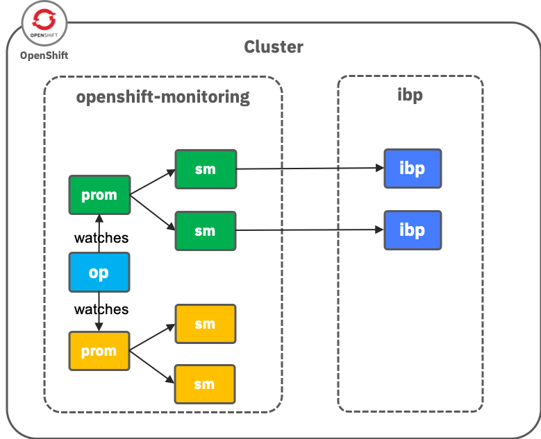

# IBM Blockchain Platform Monitoring in Openshift

Notice: This guide is currently very minimal and will be updated to be more verbose in time

A separate `Prometheus` instance will be deployed to monitor IBM Blockchain Platform



1. Create `ServiceAccount`, `ClusterRole` and `ClusterRoleBinding`

   ```bash
   oc apply -f serviceaccount-prometheus.yaml
   ```

2. Create `Service` and `Route`. TLS secret for prometheus proxy will be created

    ```bash
    oc apply -f prometheus-service.yaml
    ```

3. Create mutual TLS secret for operations service

    ```bash
    create secret generic os-operator-secret --from-file=./operator.pem --from-file=./operator.key -n openshift-monitoring
    ```

4. Create `Prometheus` instance

   ```bash
   oc apply -f prometheus-ibp.yaml
   ```

5. Create `ServiceMonitor`

   ```bash
   oc apply -f os-servicemonitor.yaml
   ```

6. Create `Service` exposing the operations endpoint in `ibp` project/namespace

   ```bash
   oc apply -f os-metrics-service.yaml
   ```
