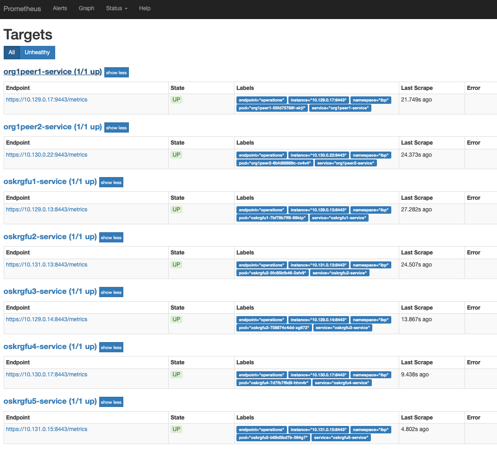

# IBM Blockchain Platform Monitoring in Openshift

## Architecture


In Openshift 3.11, default `Prometheus` and `Prometheus Operator` instances are already deployed. However, we cannot make any changes to those deployments. Thus, leveraging the existing `Prometheus Operator`, a separate `Prometheus` instance is required to monitor IBM Blockchain Platform. A `Grafana` deployment pulls metrics from the `Prometheus` instance

## Environment

* Openshift 3.11 cluster deployed on IBM Cloud Infrastructure
* IBM Blockchain Platform v2.1.0

## Prerequsities

Retrieving metrics from the peer and orderer requires mutual TLS authentication, so we need to generate certificate-key pairs for both the orderer organization and peer organization

1. In **IBP console**, go to **Nodes** > **org1ca** (the CA of the peer organization). Register a new user with enroll ID `monitoring` and enroll secret `monitoringpw`. Enroll this user against the **TLS Certificate Authority** and download the wallet. The file name of the wallet is assumed to be `org1monitoring.json`

2. In **IBP console**, go to **Nodes** > **osca** (the CA of the orderer organization). Register a new user with enroll ID `monitoring` and enroll secret `monitoringpw`. Enroll this user against the **TLS Certificate Authority** and download the wallet. The file name of the wallet is assumed to be `osmonitoring.json`

3. Decode the certificates and private keys:

   ```console
   jq -r .private_key org1monitoring.json | base64 --decode > org1monitoring.key
   jq -r .cert org1monitoring.json | base64 --decode > org1monitoring.pem
   jq -r .private_key osmonitoring.json | base64 --decode > osmonitoring.key
   jq -r .cert osmonitoring.json | base64 --decode > osmonitoring.pem
   ```

4. Create secret

   ```console
   $ oc create secret generic org1-monitoring-secret --from-file=./org1monitoring.pem --from-file=./org1monitoring.key -n openshift-monitoring
   secret/org1-monitoring-secret created
   $ oc create secret generic os-monitoring-secret --from-file=./osmonitoring.pem --from-file=./osmonitoring.key -n openshift-monitoring
   secret/os-monitoring-secret created
   ```

5. Create secret for basic authentication of `Prometheus`. Remember the password set

   ```bash
   htpasswd -s -c auth ibp
   oc create secret generic prometheus-ibp-htpasswd -n openshift-monitoring --from-file auth
   ```

## Prometheus Deployment

1. Create `ServiceAccount`, `ClusterRole` and `ClusterRoleBinding` and required `Secrets`:

   ```bash
   oc apply -f serviceaccount-prometheus.yaml
   ```

2. Create `Service` and `Route`. TLS secret for prometheus proxy will be created automatically (Refer to <https://docs.openshift.com/container-platform/3.11/dev_guide/secrets.html#service-serving-certificate-secrets)>

    ```bash
    oc apply -f prometheus-service.yaml
    ```

3. Create `Prometheus` instance

   ```bash
   oc apply -f prometheus-ibp.yaml
   ```

4. Create `ServiceMonitor` for Ordering service and Peer

   ```bash
   oc apply -f os-servicemonitor.yaml
   oc apply -f org1-servicemonitor.yaml
   ```

5. Create `Service` exposing the operations endpoint in `ibp` project/namespace

   ```bash
   oc apply -f os-metrics-service.yaml
   oc apply -f org1-metrics-service.yaml
   ```

6. Trigger configuration refresh manually

   ```bash
   oc exec prometheus-ibp-0 -c prometheus -- curl -X POST http://localhost:9090/-/reload
   ```

7. Visit prometheus endpoint and login using Openshift credential. To retrieve address:
  
   ```bash
   echo "https://$(oc get routes prometheus-ibp -n openshift-monitoring -o json | jq -r .spec.host)"
   ```

8. Go to **Status** > **Targets** and a similar screen should be shown:

   

## Grafana Deployment

1. In `grafana.yaml`, search for `GF_SECURITY_ADMIN_USER` and change the value to your Openshift username

2. Deploy `Grafana`

   ```bash
   oc apply -f grafana-ibp.yaml
   ```

3. Visit grafana endpoint and login using Openshift credential. To retrieve address:
  
   ```bash
   echo "https://$(oc get routes grafana-ibp -n openshift-monitoring -o json | jq -r .spec.host)"
   ```
